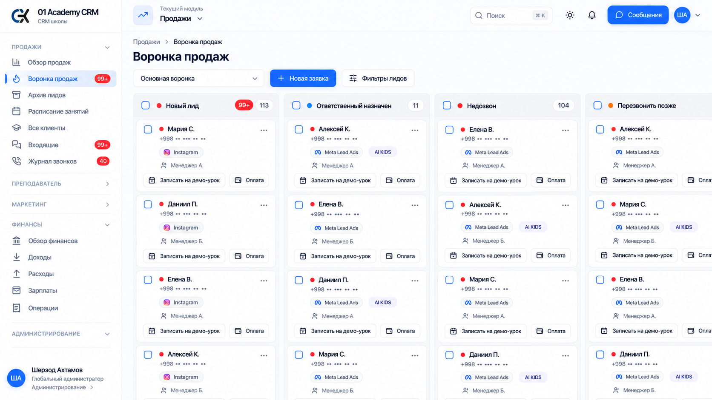
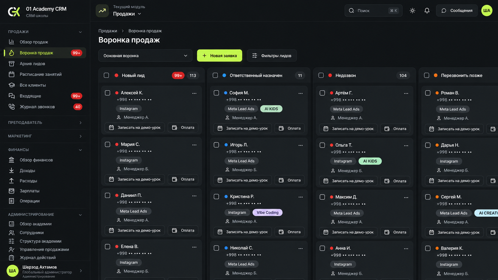
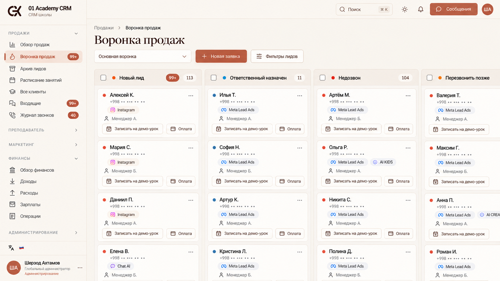
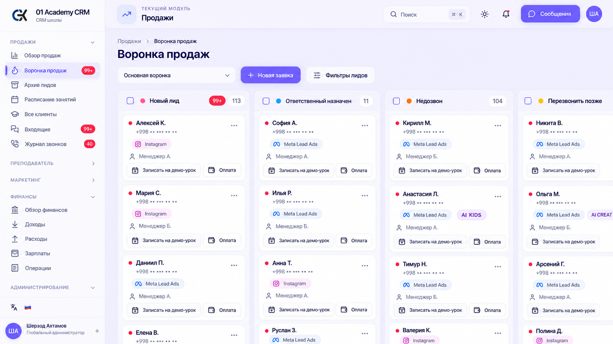
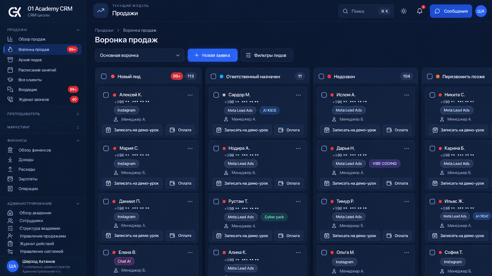
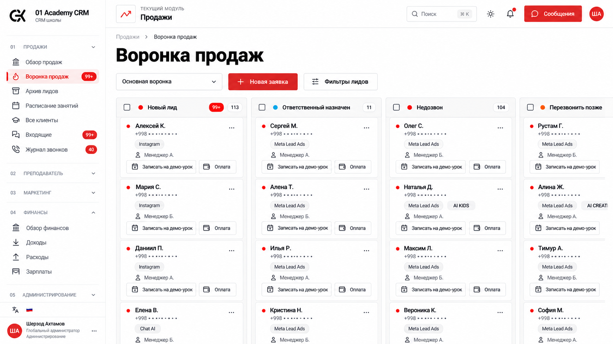
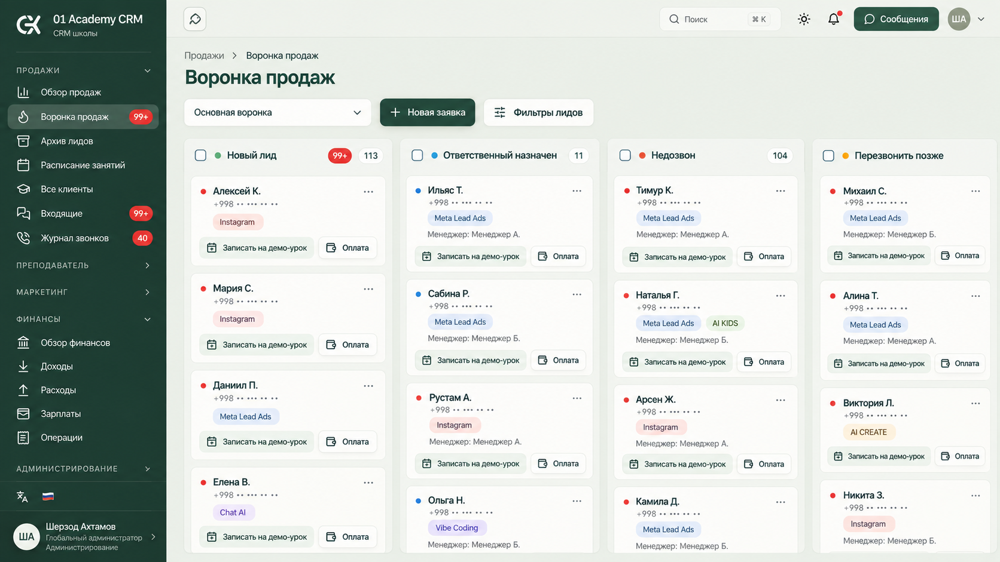
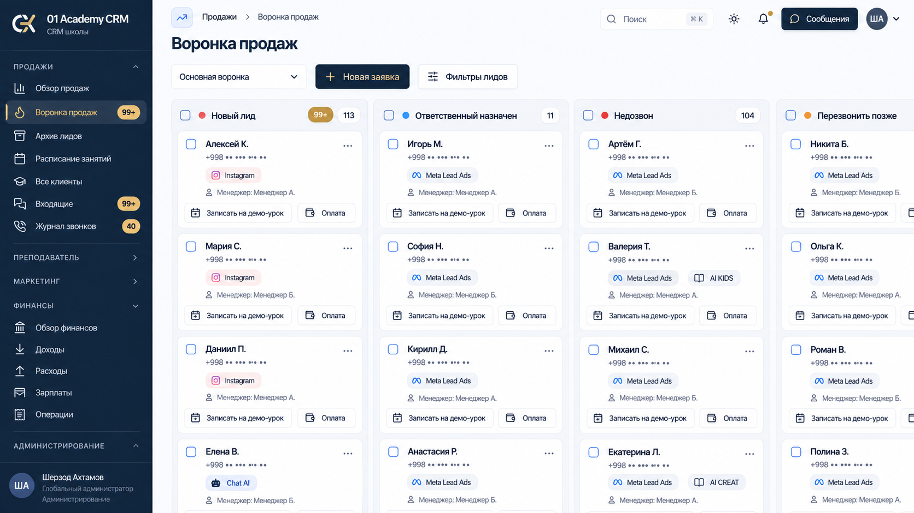
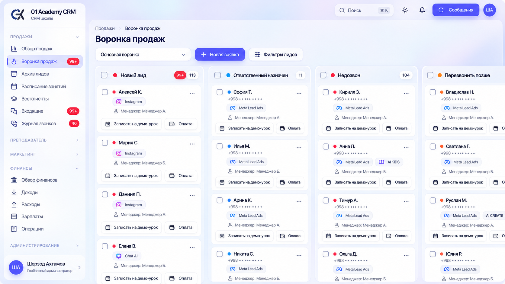
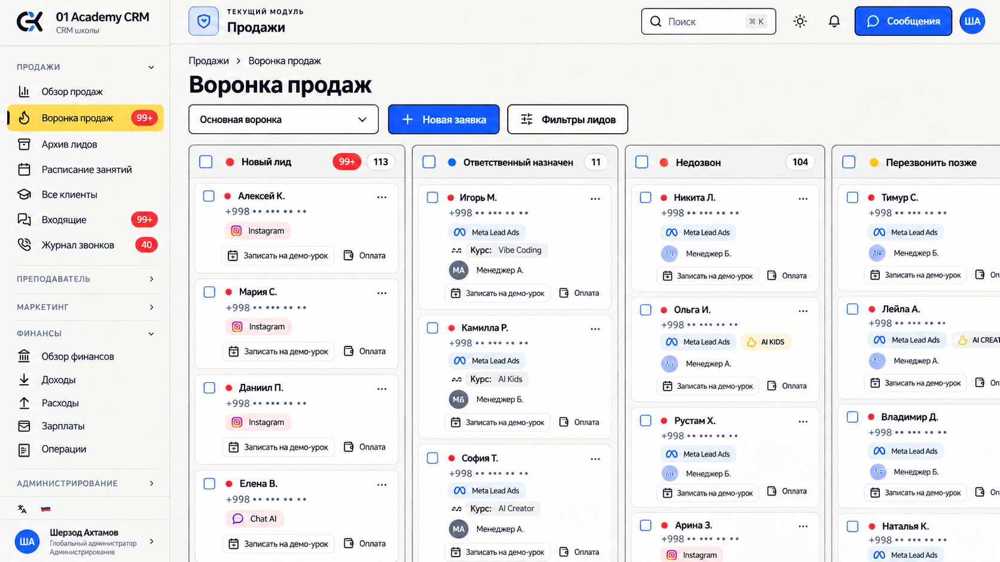

# UI/UX: 10 вариантов на основе настоящих скриншотов CRM

**Серии для сравнения:** [11–20 — более смелые концепции](bold/README.md) · [21–30 — минималистичные стили](minimal/README.md).

Дата: 3 октября 2026 года. Исходный код изучен на ветке main, базовый коммит 319c3438.

Метод: сначала изучены маршруты, страницы, общие компоненты и действующий интерфейс; затем сняты настоящие скриншоты в авторизованной браузерной сессии. Для каждой генерации в imagegen явно переданы пять файлов: действующая воронка продаж, обзор академии, календарь занятий, таблица клиентов и модальная карточка лида. Воронка — основной экран для редизайна, остальные изображения — контекст общей системы.

Все десять итоговых изображений показывают ту же настоящую воронку в разных стилях. Они предназначены для выбора визуального направления; это не реализованные изменения CRM. Клиентские имена в концептах условные, телефоны замаскированы. Исходные скриншоты находятся локально в игнорируемой папке tmp/design-references-2026-10-03 и не включены в репозиторий.

## Что изучено

32 основных раздела интерфейса проверены в браузере и сопоставлены с кодом. Внутренние вкладки настроек также просмотрены. Страница входа, 404 и Telegram-приложение задач изучены по исходному коду. Разные размеры окна, все роли и все состояния данных отдельно не проверялись.

| Раздел | Страницы и основные элементы | Направление улучшения |
| --- | --- | --- |
| Продажи — 7 страниц | Обзор, воронка, архив, расписание, клиенты, входящие, журнал звонков. KPI и графики, Kanban, DataTable, календарь, переписка и модальные карточки. | Компактнее шапка и фильтры; больше полезной области доски; одинаковая иерархия имени, источника, курса и менеджера; хорошо различимые непрочитанные записи и статусы. |
| Преподаватель — 4 страницы | Показатели, расписание, группы, посещаемость. Ближайшее занятие, прогресс групп, календарь и модальное окно отметки занятия. | Выделить ближайшее действие, уменьшить повторение крупных панелей, унифицировать карточки групп и состояния занятий. |
| Маркетинг — 7 страниц | Обзор, источники, воронка и конверсия, рефералы, расходы, атрибуция Meta, события Meta. Аналитика и широкие таблицы. | Согласовать размеры KPI и фильтров; сделать широкие таблицы удобнее для сканирования; одинаково оформлять деньги, проценты и состояния. |
| Финансы — 5 страниц | Обзор, доходы, расходы, зарплаты, операции. Реестры, графики, формы и подтверждения действий. | Ровные числовые колонки, единые статусы, более компактная верхняя часть; сохранить понятные модальные подтверждения. |
| Администрирование — 6 страниц | Обзор академии, сотрудники, структура, управление продажами, журнал действий, управление системой. | Облегчить общую навигацию; унифицировать таблицы, вкладки, кнопки и формы. |
| Управление системой — 2 дочерние страницы | Интеграции и уведомления сотрудникам. Карточки подключений, списки получателей, Dialog создания сообщения. | Общий язык карточек и фильтров, чёткая иерархия действий. |
| Задачи — 1 страница | Kanban/календарь, активные/архив, фильтр сотрудника, Dialog создания и Sheet задачи. | Уменьшить плотность повторяющихся кнопок, сохранить различимость приоритетов и сроков. |
| Структура академии | Вкладки школ, кабинетов, курсов и групп. | Общий DataTable и единообразные модальные формы. |
| Управление продажами | Распределение лидов, этапы, воронки, объединение дублей, планы сотрудников. | Единые Tabs и кнопки; группировка полей внутри текущих Dialog. |
| Общий интерфейс | Sidebar, Header, CommandPalette, уведомления, языки RU/EN, светлая/тёмная тема, защита несохранённых правок. | Более компактная навигация и единые размеры, отступы, типографика, контраст и состояния. |

## Варианты реализации после выбора темы

- **Компактная рабочая тема:** DataTable и Kanban с небольшими отступами, короткими панелями фильтров, фиксированными заголовками; основные действия остаются на виду, второстепенные — в DropdownMenu.
- **Более свободная компоновка:** округлые карточки и мягкие поверхности, тот же набор действий и полей, единые Tabs для связанных разделов.
- **Строгая типографическая тема:** чёткая сетка, минимальные тени и ровные линии, выраженная иерархия заголовков и чисел.

Во всех направлениях существующие карточки лидов, учеников, задач и занятий остаются модальными Dialog/Sheet. Опасные действия сохраняют AlertDialog, несохранённые правки — текущую защиту. Тексты будущего интерфейса должны проходить через client/src/lib/i18n.ts с RU/EN. Технические пояснения в пользовательские экраны не добавляются.

## Галерея

### 01. Чистый минимализм

### 02. Графит и лайм

### 03. Тёплая редакционная тема

### 04. Мягкая пастель

### 05. Полночный индиго

### 06. Швейцарская сетка

### 07. Шалфей и хвоя

### 08. Деловой navy

### 09. Светлое стекло

### 10. Смелая академия

Полный набор запросов и порядок референсов: [prompts.json](prompts.json). Точечное исправление подписей в варианте 10: [corrections.json](corrections.json). Генерация выполнена встроенным image_gen с referenced_image_paths. Прежние концепты с придуманной компоновкой не входят в эту галерею.

Проверка артефактов: 10 разных PNG размером 1672 × 941; проверены целостность файлов, ссылки галереи и наличие всех запросов. Исходный код приложения не менялся.
