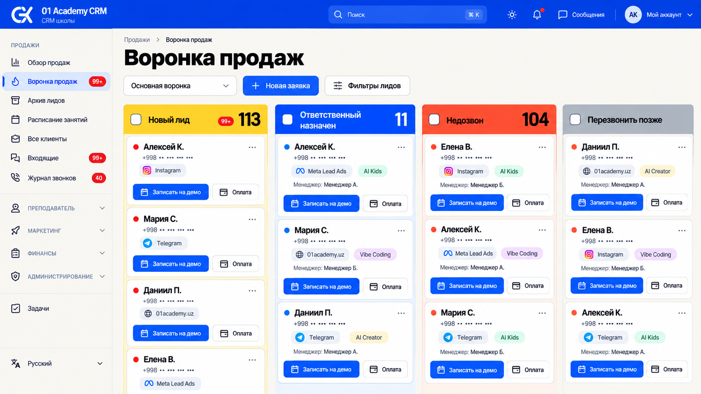
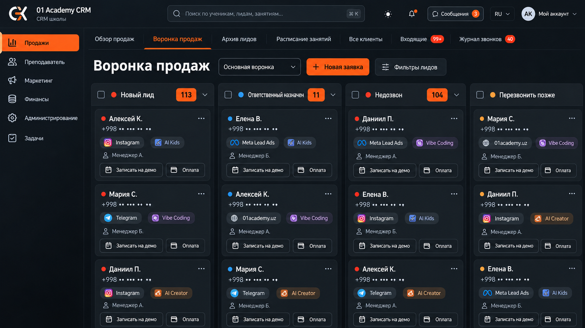
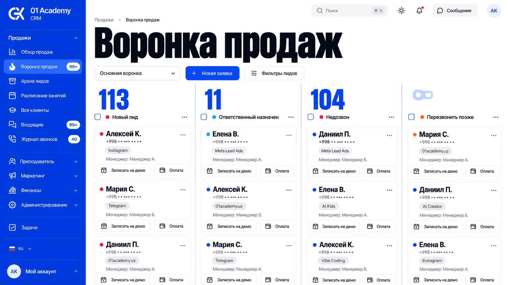
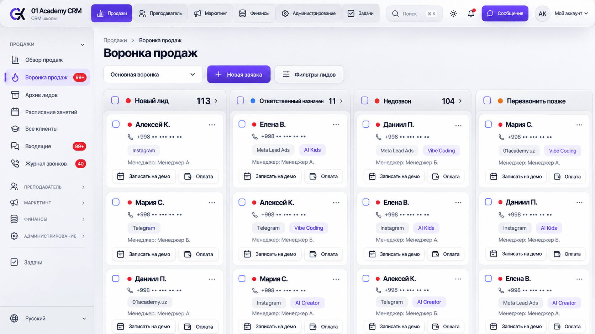
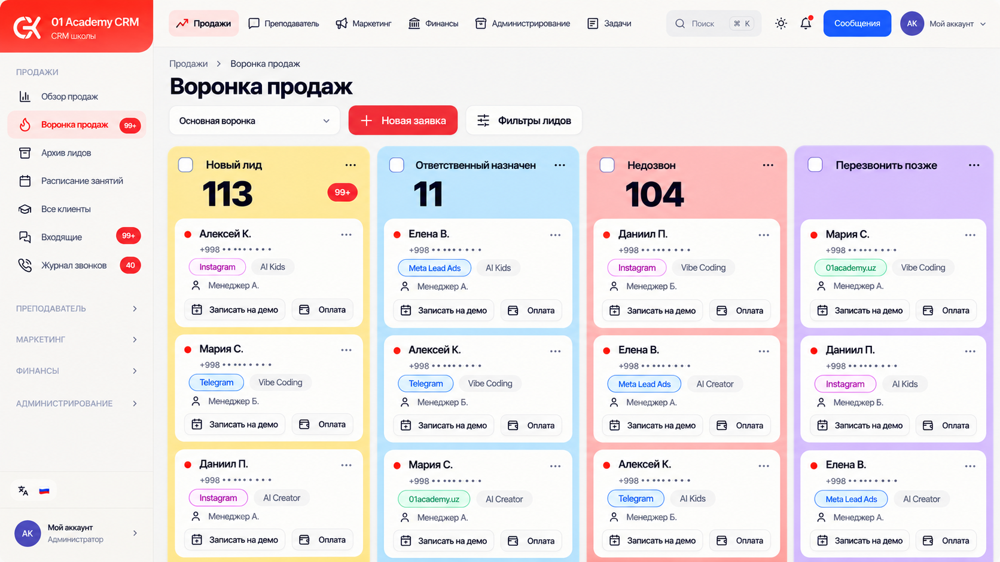
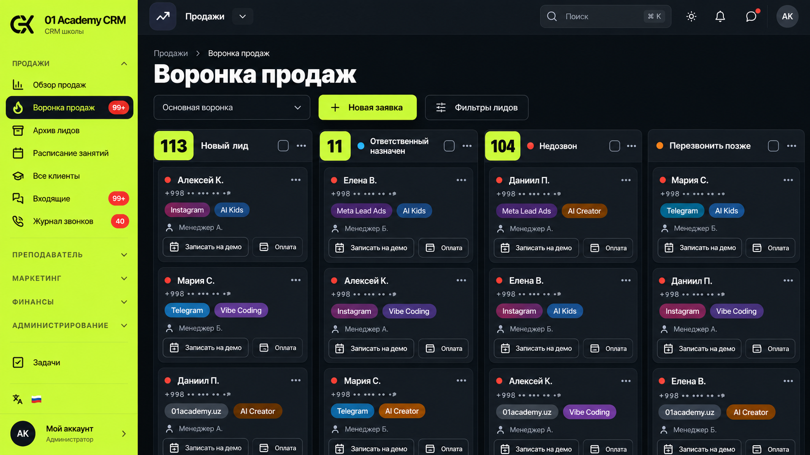
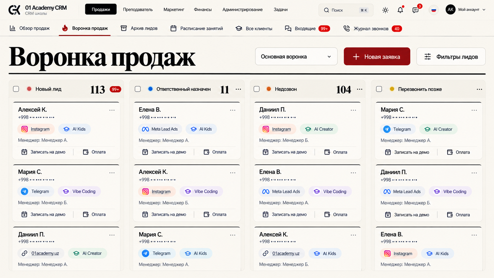
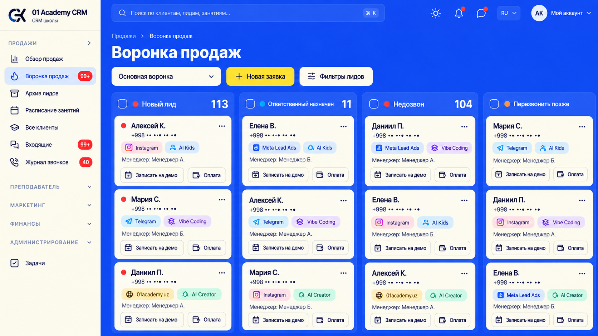
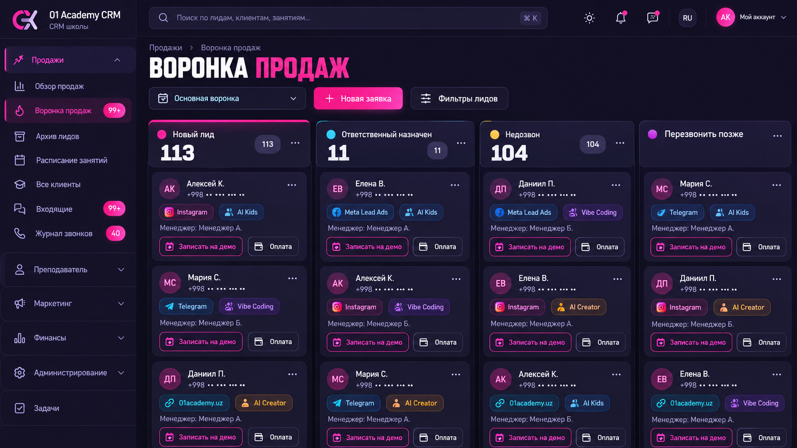
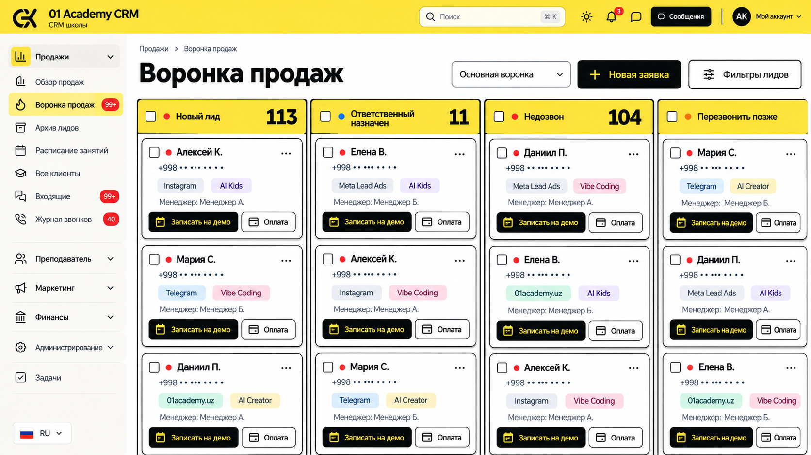

# 11–20: более смелые концепции 01 Academy CRM

Вторая серия по запросу «идеи чуть посмелее». Создана встроенным image_gen по тем же пяти настоящим скриншотам CRM: воронка, обзор академии, календарь, таблица клиентов и модальная карточка лида. Основной экран сравнения — существующая воронка продаж.

В этой серии сильнее меняются композиция, масштаб типографики, форма компонентов, контраст и организация навигации. Предложены компактный Sidebar, отдельная панель модулей с верхними Tabs и две горизонтальные строки навигации. В каждом варианте сохраняется назначение Kanban, существующие разделы и быстрые действия. Карточки записей по-прежнему предполагают открытие в Dialog/Sheet, опасные действия — подтверждение.

Изображения предназначены для выбора направления. При реализации выбранного варианта размеры элементов и плотность следует адаптировать к работе с большим числом лидов; крупная типографика в экспериментальных вариантах — предмет выбора, а не обязательное требование для всех экранов. Клиентские имена условные, телефоны замаскированы. Исходные скриншоты остаются в локальной игнорируемой папке tmp/design-references-2026-10-03.

| Номер | Направление | Идея UI/UX |
| --- | --- | --- |
| 11 | Электрический Баухаус | Узкая навигация, цветовые блоки этапов, крупные счётчики. |
| 12 | Гоночный пульт | Компактная панель модулей, навигация продаж в Tabs, плотные карточки. |
| 13 | Кобальтовая суперграфика | Крупная типографика, плоские карточки, минимум визуальных рамок. |
| 14 | Титановый Orbit | Верхняя панель модулей, компактный контекстный список разделов, объёмные кнопки. |
| 15 | Цветной Studio | Разные цвета этапов, выразительные карточки, общий ряд модулей сверху. |
| 16 | Кислотная точность | Лаймовая навигация, строгая доска, крупные числа и контрастные действия. |
| 17 | Бумага и тушь | Горизонтальная навигация, широкая доска, редакционная иерархия. |
| 18 | Ультрамариновая среда | Синяя рабочая область, светлые карточки, выразительные заголовки этапов. |
| 19 | Нео-Токио | Контрастная тёмная тема, компактная навигация, выразительные маркеры состояний. |
| 20 | Сигнальный жёлтый | Жёлтая шапка, чёрные акценты, плотная доска с чёткими границами. |

## 11. Электрический Баухаус

Узкая навигация, цветовые блоки этапов, крупные счётчики.

## 12. Гоночный пульт

Компактная панель модулей, навигация продаж в Tabs, плотные карточки.

## 13. Кобальтовая суперграфика

Крупная типографика, плоские карточки, минимум визуальных рамок.

## 14. Титановый Orbit

Верхняя панель модулей, компактный контекстный список разделов, объёмные кнопки.

## 15. Цветной Studio

Разные цвета этапов, выразительные карточки, общий ряд модулей сверху.

## 16. Кислотная точность

Лаймовая навигация, строгая доска, крупные числа и контрастные действия.

## 17. Бумага и тушь

Горизонтальная навигация, широкая доска, редакционная иерархия.

## 18. Ультрамариновая среда

Синяя рабочая область, светлые карточки, выразительные заголовки этапов.

## 19. Нео-Токио

Контрастная тёмная тема, компактная навигация, выразительные маркеры состояний.

## 20. Сигнальный жёлтый

Жёлтая шапка, чёрные акценты, плотная доска с чёткими границами.

[Полные запросы для imagegen](prompts.json) · [Предыдущие варианты 01–10](../README.md)

Приложение и его данные в рамках этой серии не редактируются: результат — изображения и документация для выбора дизайн-направления.
