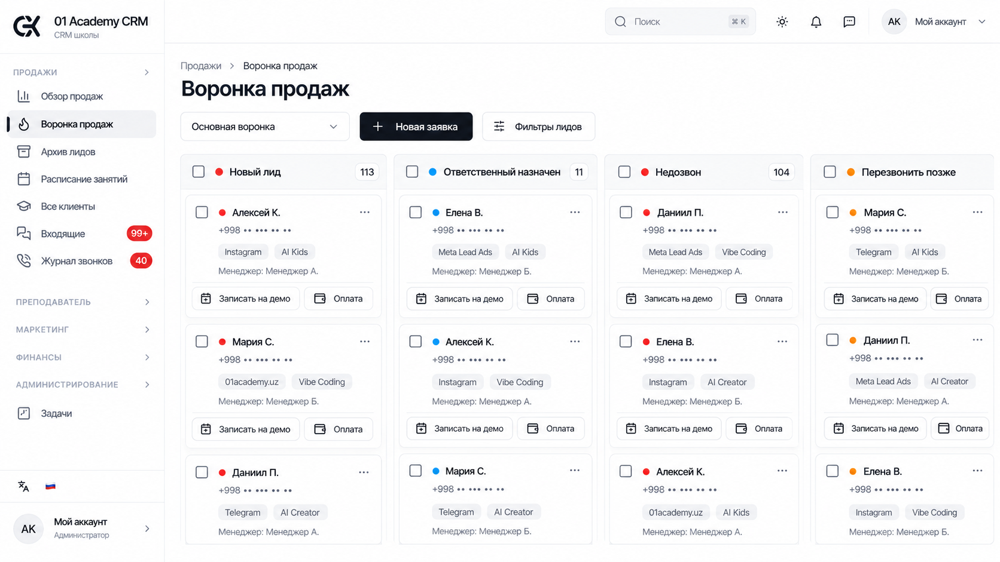
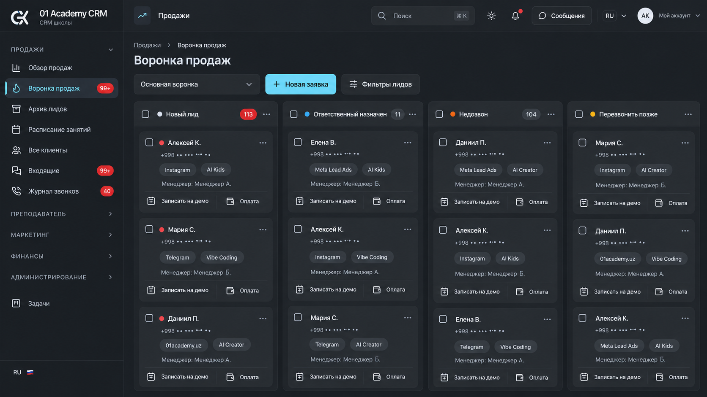
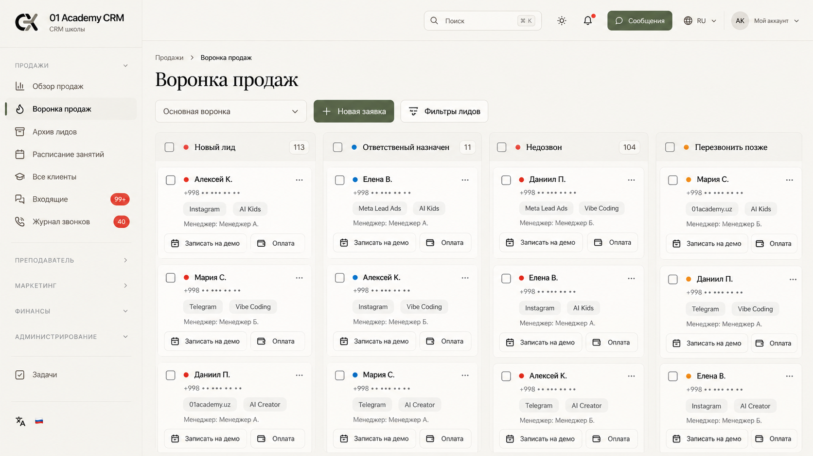
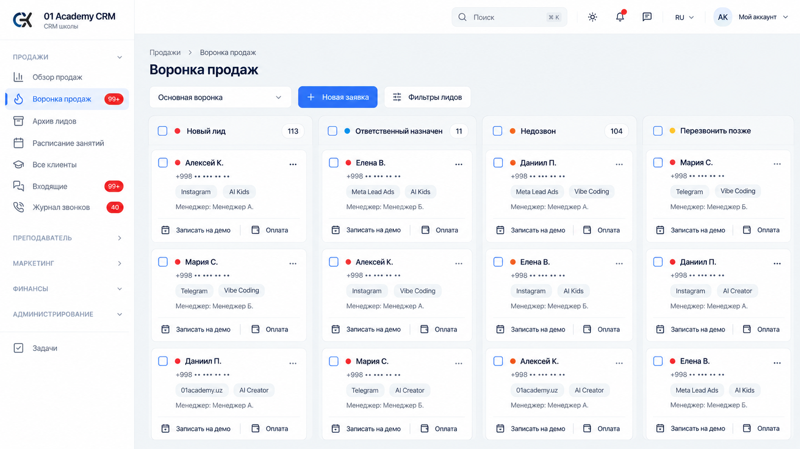
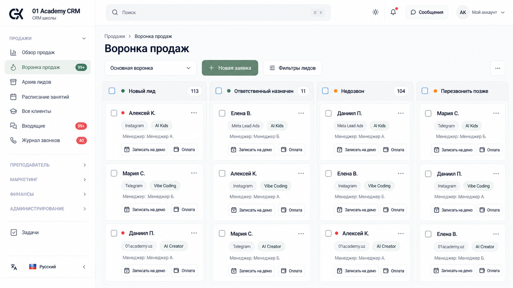
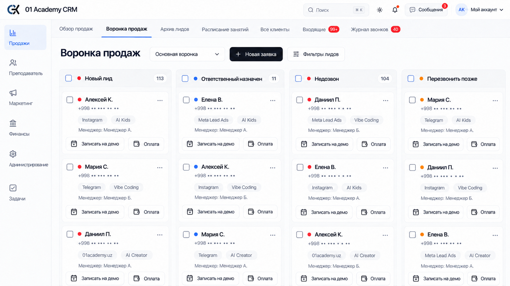
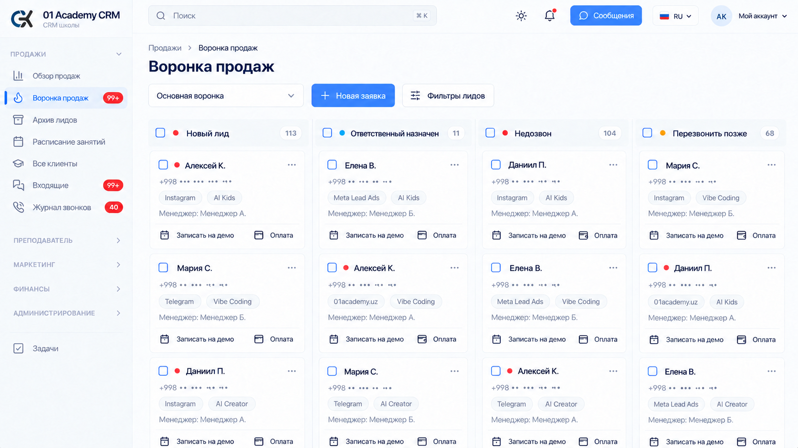
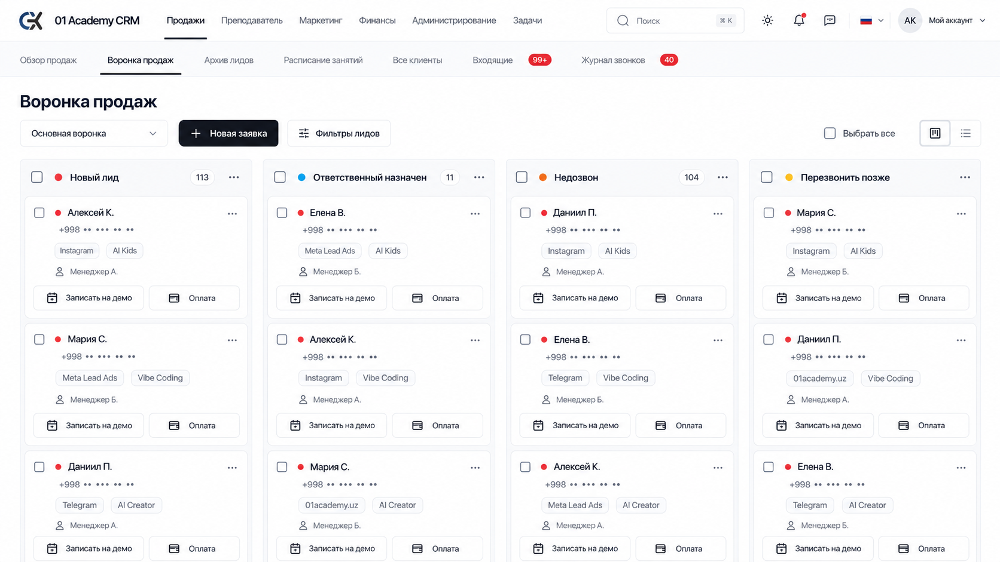
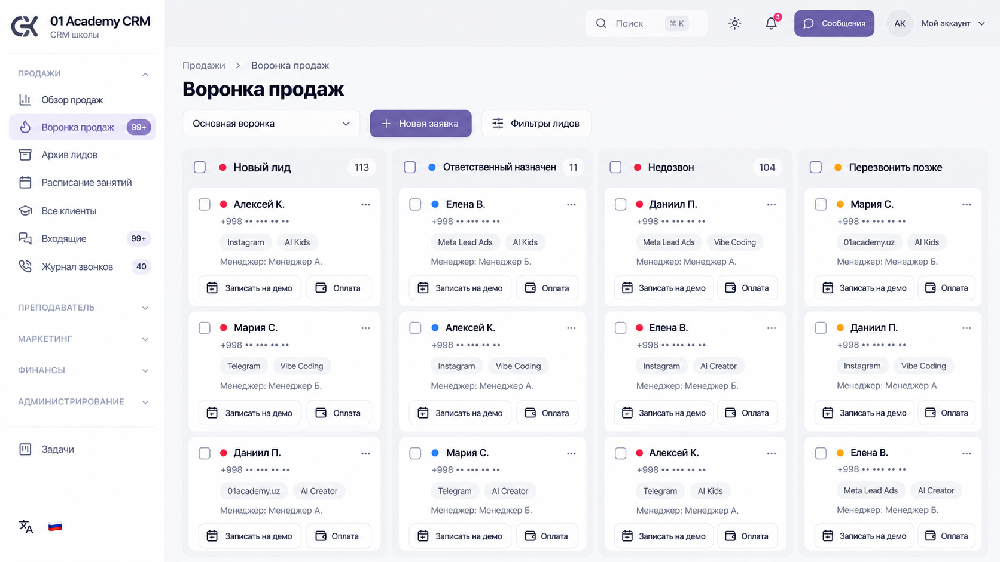
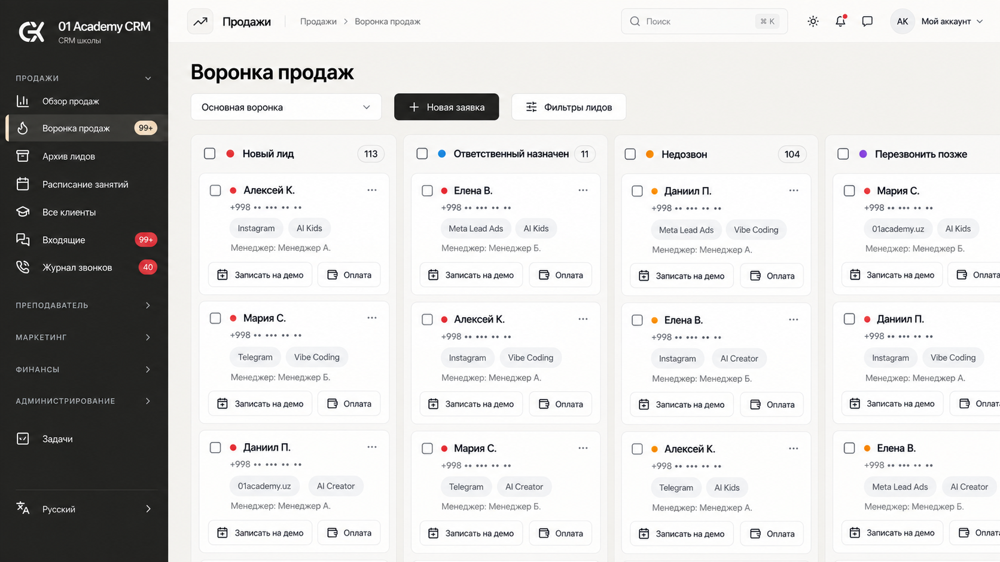

# 21–30: минималистичные концепции 01 Academy CRM

Третья серия по запросу «давай минималистичные стили». Все десять изображений созданы встроенным image_gen по пяти настоящим скриншотам CRM: воронка продаж, обзор академии, календарь, таблица клиентов и модальная карточка лида. Для сравнения везде показан один существующий экран — воронка продаж.

Основные различия — плотность, типографика, организация навигации, рамки и поверхности. Предложены три варианта навигации: компактный Sidebar, узкая панель модулей с верхними Tabs, две горизонтальные строки без постоянного Sidebar. В карточках сохраняются данные и быстрые действия. Детали записей остаются в Dialog/Sheet, удаление предполагает подтверждение.

Имена клиентов и менеджеров условные, телефоны замаскированы. Исходные скриншоты хранятся только в локальной игнорируемой папке. Изображения служат для выбора дизайн-направления; интерфейс CRM пока не изменён.

| Номер | Направление | Идея UI/UX |
| --- | --- | --- |
| 21 | Чистый монохром | Белый интерфейс, тонкие разделители, компактный Sidebar и чёрная основная кнопка. |
| 22 | Спокойный графит | Тёмная рабочая область, спокойный контраст, один сдержанный акцент. |
| 23 | Тёплая бумага | Молочные поверхности, мягкая типографика, нейтральные метки и минимум рамок. |
| 24 | Северный серый | Светло-серая доска, белые карточки и ясная иерархия без лишнего контраста. |
| 25 | Мягкий шалфей | Светлая тема с небольшими зелёными акцентами и спокойным ритмом карточек. |
| 26 | Компактная сетка | Узкая панель модулей, верхние Tabs разделов продаж и плотная доска. |
| 27 | Тихий синий | Белая тема, тёмно-синяя типографика и небольшие голубые акценты. |
| 28 | Горизонтальный воздух | Две строки навигации сверху, широкая доска и минимум контейнеров. |
| 29 | Мягкий фарфор | Светлые карточки без заметных рамок, мягкие радиусы и спокойный фиолетовый акцент. |
| 30 | Тушь и песок | Тёмная компактная навигация, светлая доска и тёплые нейтральные оттенки. |

## 21. Чистый монохром

Белый интерфейс, тонкие разделители, компактный Sidebar и чёрная основная кнопка.

## 22. Спокойный графит

Тёмная рабочая область, спокойный контраст, один сдержанный акцент.

## 23. Тёплая бумага

Молочные поверхности, мягкая типографика, нейтральные метки и минимум рамок.

## 24. Северный серый

Светло-серая доска, белые карточки и ясная иерархия без лишнего контраста.

## 25. Мягкий шалфей

Светлая тема с небольшими зелёными акцентами и спокойным ритмом карточек.

## 26. Компактная сетка

Узкая панель модулей, верхние Tabs разделов продаж и плотная доска.

## 27. Тихий синий

Белая тема, тёмно-синяя типографика и небольшие голубые акценты.

## 28. Горизонтальный воздух

Две строки навигации сверху, широкая доска и минимум контейнеров.

## 29. Мягкий фарфор

Светлые карточки без заметных рамок, мягкие радиусы и спокойный фиолетовый акцент.

## 30. Тушь и песок

Тёмная компактная навигация, светлая доска и тёплые нейтральные оттенки.

[Полные запросы imagegen](prompts.json) · [Исправления подписей](corrections.json) · [Серия 01–10 и анализ интерфейса](../README.md) · [Смелые варианты 11–20](../bold/README.md)
